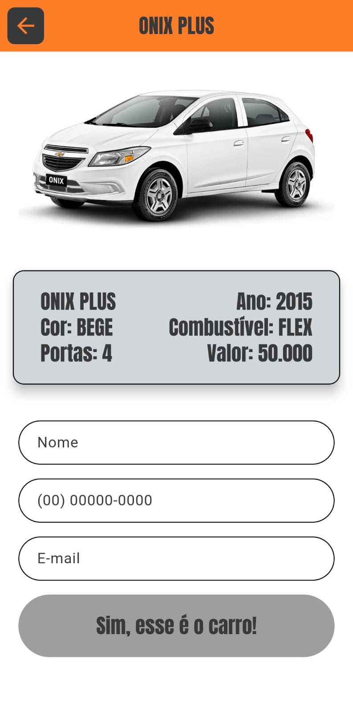
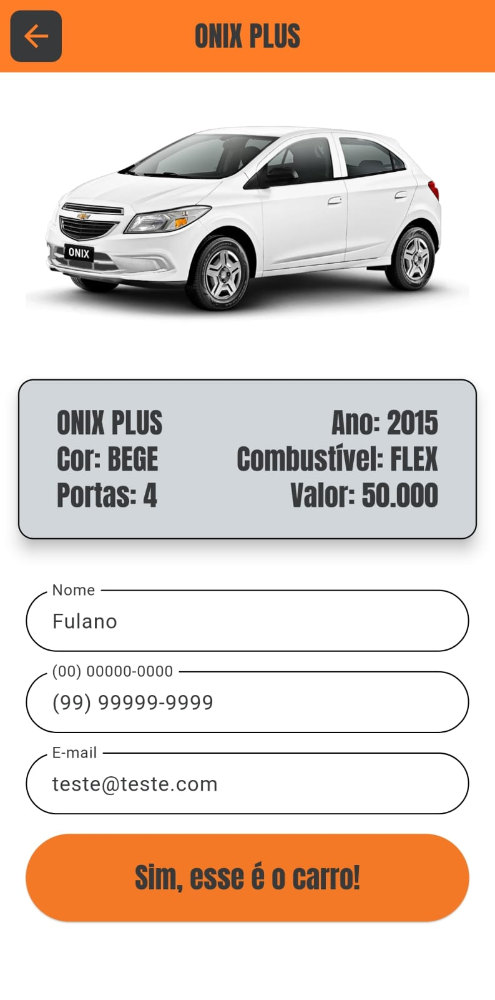
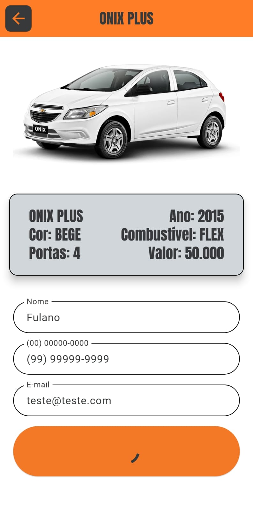
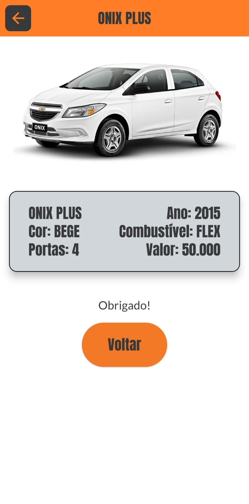
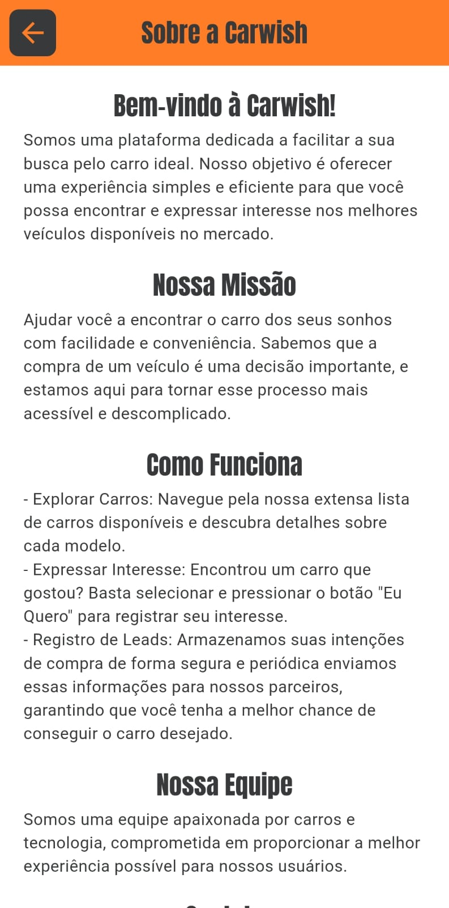
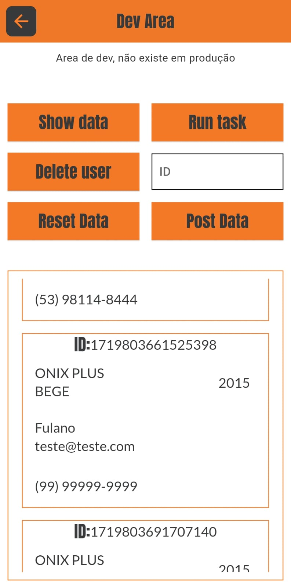

# CarWish

**CarWish** é um aplicativo desenvolvido para listar carros, mostrar detalhes sobre cada carro e permitir que os usuários se manifestem se estiverem interessados em um carro específico. O aplicativo também possui uma área temporária de desenvolvimento para testes de funcionalidades e manutenção do banco de dados.

DOWNLOAD DA BUILD: [app-arm64-v8a-release.apk](https://files.fm/u/6xs9hyx8wg)
DOWNLOAD DA BUILD: [Download](https://files.fm/u/vx6zqjvnad)
Relatório técnico:

## Tabelas de Conteúdo

- [Sobre o Projeto](#sobre-o-projeto)
- [Funcionalidades](#funcionalidades)
- [Como Usar](#como-usar)
- [Estrutura do Código](#estrutura-do-código)
- [Navegando pelo App](#navegando-pelo-app)
- [Configuração do Ambiente](#configuração-do-ambiente)
- [Contribuindo](#contribuindo)
- [Licença](#licença)

## Sobre o Projeto

O **CarWish** é um aplicativo desenvolvido utilizando **Flutter** para listar carros, mostrar detalhes e permitir o envio de interesse por um carro. O projeto foi desenvolvido com o objetivo de demonstrar as habilidades em Flutter e soluções de backend para aplicações móveis.

O app conta com uma área de desenvolvimento para testes de funcionalidades e manutenção do banco de dados, e foi construído com um prazo de 2 dias para a sua execução.

## Funcionalidades

- **Tela Inicial**: Exibe uma lista de carros obtidos de um endpoint de API. Os carros são exibidos em uma lista rolável.
- **Página de Detalhes do Carro**: Ao clicar em um carro, você é direcionado para uma página com os detalhes do carro e um formulário para expressar interesse.
- **Formulário de Interesse**: Permite ao usuário preencher dados (nome, telefone e e-mail) para demonstrar interesse em um carro. O botão de envio só é ativado quando todos os campos são preenchidos corretamente.
- **Área de Desenvolvimento**: Seção acessível para teste de envio de dados, gerenciamento de leads, e reset do banco de dados.
- **Menu Lateral**: Inclui opções para navegar entre a tela inicial, a página sobre nós e a área de desenvolvimento.

## Como Usar

### Inicialização do Projeto

1. **Clone o Repositório**

   ```bash
   git clone https://github.com/seu-usuario/carwish.git

   ```

2. **Navegue até o diretório do projeto**

   ```bash
   cd carwish

   ```

3. **Instale as dependências**

   ```bash
   flutter pub get

   ```

4. **Execute o aplicativo**

   ```bash
   flutter run

   ```

## Estrutura do Código

- **`lib/`**: Contém o código-fonte do aplicativo.

  - **`common/`**: Contém arquivos de configuração e utilitários compartilhados.

    - **`app_routes.dart`**: Configuração das rotas do aplicativo.
    - **`get_input_decoration.dart`**: Decoração de campos de entrada de dados.
    - **`my_colors.dart`**: Definição das cores utilizadas no aplicativo.
    - **`task_manager.dart`**: Gerenciamento das tarefas do `Workmanager`.

  - **`database/`**: Contém a configuração e interações com o banco de dados SQLite.

    - **`database_config.dart`**: Configuração do banco de dados e inicialização.

  - **`model/`**: Contém as classes de modelos de dados.

    - **`car_user.model.dart`**: Modelo de dados que combina `Car` e `User`.
    - **`car.model.dart`**: Modelo de dados para os carros.
    - **`user.model.dart`**: Modelo de dados para os usuários interessados.

  - **`pages/`**: Contém os arquivos das páginas do aplicativo.

    - **`about_us_page.dart`**: Página com informações sobre a equipe e o projeto.
    - **`car_detail_page.dart`**: Página com detalhes do carro e formulário de interesse.
    - **`carlist_overview_page.dart`**: Página inicial com a lista de carros disponíveis.
    - **`dev_control_page.dart`**: Área de desenvolvimento para teste e manutenção.
    - **`page_not_found.dart`**: Página exibida quando uma rota não é encontrada.

  - **`services/`**: Contém os serviços para interagir com a API.

    - **`car_user.service.dart`**: Serviço para gerenciar leads e interações com o `CarUser`.
    - **`car.service.dart`**: Serviço para buscar a lista de carros e detalhes dos carros.

  - **`widget/`**: Contém widgets personalizados utilizados em várias partes do aplicativo.

    - **`app_bar_custom.dart`**: Widget para a `AppBar` personalizada.
    - **`app_drawer.dart`**: Widget para o menu lateral do aplicativo.
    - **`car_detail_image.dart`**: Widget para exibir imagens do carro na página de detalhes.
    - **`car_detail_panel.dart`**: Widget para exibir informações detalhadas do carro.
    - **`car_item.dart`**: Widget para exibir um item de carro na lista.
    - **`car_list_widget.dart`**: Widget para exibir a lista de carros.
    - **`purchase_form.dart`**: Widget para o formulário de interesse do usuário.

  - **`main.dart`**: O ponto de entrada do aplicativo, configurando as rotas e o tema.

## Navegando pelo App

- **Tela Inicial:** Apresenta a lista de carros.

 

- **Página de Detalhes do Carro:** Mostra informações detalhadas sobre o carro e um formulário para demonstrar interesse.

<div style="display: flex; flex-direction: row;">
  
  
  
  
</div>

- **Menu Lateral:** Navegue entre as páginas "Início", "Sobre Nós" e "Dev Area".


- **Pagina Sobre Nós** Esta página fornece informações sobre a equipe de desenvolvimento e a visão do projeto..



- **Área de Desenvolvimento:** Teste funcionalidades e gerencie o banco de dados.



## Configuração do Ambiente

Para configurar o ambiente de desenvolvimento, siga estas etapas:

1. **Instale o Flutter**

   Siga as instruções no [site oficial do Flutter](https://flutter.dev/docs/get-started/install).

2. **Configure o Android SDK**

   Certifique-se de que o Android SDK está instalado e corretamente configurado. O caminho do SDK deve estar configurado nas variáveis de ambiente.

3. **Aceite as Licenças do SDK**

   Execute o comando abaixo para aceitar as licenças necessárias:

   ```bash
   flutter doctor --android-licenses
   ```

4. **Instale Dependências Adicionais**

   Certifique-se de que você tem clang++ e GTK 3.0 instalados:

   ```bash
   sudo apt-get install clang++
   sudo apt-get install libgtk-3-dev
   ```

5. **Execute flutter doctor**
   Verifique se todas as dependências estão instaladas corretamente:

   ```bash
   flutter doctor
   ```

## Contribuindo

Se você deseja contribuir para este projeto, siga estas etapas:

## Contribuindo

Se você deseja contribuir para este projeto, siga estas etapas:

1. **Fork o Repositório**

   Crie um fork do repositório no GitHub.
   <br>

2. **Crie uma Branch para sua Feature**

   ```bash
   git checkout -b minha-nova-feature
   ```

3. **Faça Commit das Suas Alterações**

   ```bash
   git commit -am 'Adicionando nova feature'
   ```

4. **Envie a Branch para o Repositório**
   ```bash
   git push origin minha-nova-feature
   ```
5. Abra um Pull Request

- Vá para o repositório original e abra um Pull Request para a sua branch.

## Licença

- Este projeto está licenciado sob a Licença MIT.
